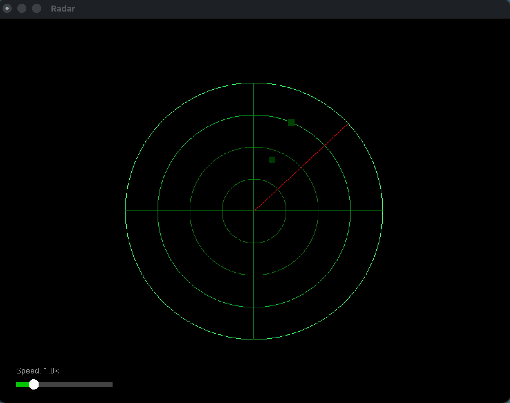

# Radar animation using OpenGL

This was a little fun project while learning how to program with OpenGL



## Prerequisites
- C++ compiler (Clang or GCC)
- OpenGL
- GLUT
- CMake (3.10+)

## Build and Run

### macOS (including Apple Silicon)

```bash
cmake -B build && cmake --build build
./build/radar
```

### Linux

```bash
cmake -B build && cmake --build build
./build/radar
```

Or using the Makefile directly:

```bash
make && ./radar
```